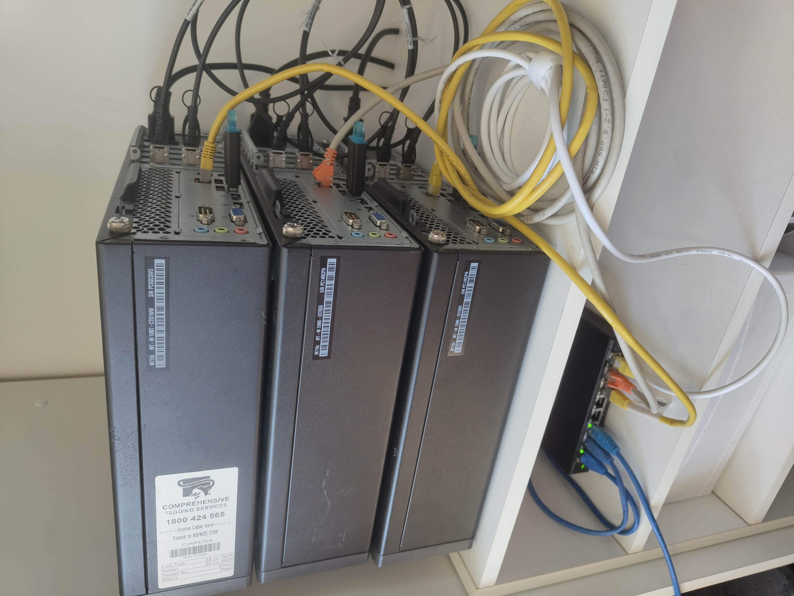

## 01 – Building a Cloud from E-Waste

### 12 PCs were headed for landfill. I turned them into my own cloud instead.

Most homelabs start with shiny new hardware.

But not this one.

With Windows 10 reaching end-of-life, large numbers of perfectly functional business PCs are being retired. Microsoft’s decision to restrict Windows 11 support to 8th-gen Intel CPUs and newer has effectively rendered a huge amount of hardware “obsolete”, at least from an enterprise support perspective.

For businesses, that’s a cost.

For the environment, it’s waste.

For me? It felt like Christmas.

These 12 machines were being decommissioned from a client site - still fully functional, just no longer compliant with policy, and were on their way to e-waste.

I stepped in, rescued them, consolidated their RAM and storage, and built three surprisingly capable nodes.

---

## The Goal

This isn’t about replacing a NAS.

I’m building a 3-node Kubernetes cluster to:

* Learn production-style infrastructure
* Explore distributed systems
* Experiment with high availability patterns
* Run real services across multiple machines

Building three new machines from scratch would have easily exceeded $1,000 - a cost I wasn’t willing to justify purely for experimentation.

But with hardware already headed for disposal, the barrier to entry disappeared.

---

## Hardware Overview

Each node is based on a **Lenovo ThinkCentre M710s** (SFF) office PC.

After some creative parts redistribution:

* **CPU:** Intel i5-7600
* **RAM:** 32GB (4×8GB consolidated from multiple machines)
* **Storage:** 4× 500GB SATA SSDs (same as above)
* **Boot Drive:** 64GB USB
* **Networking:** Intel X520-DA-2 dual-port 10Gb SFP+ NIC

The distributed storage system I plan to run (MinIO) requires identical drive sizes per node. That meant each node needed the same number and capacity of disks.

Some of the salvaged drives were only 256GB, which made them unusable for this setup. A few additional SSDs had to be sourced to keep everything symmetrical.

This early design constraint influenced the hardware layout significantly - and saved problems later.

---

## Key Decisions

### 1. “Good Enough” Beats Perfect

These machines are nearly a decade old.

They are not cutting-edge.

But they are:

* Reliable
* Replaceable
* Capable

Aside from the second-hand NICs purchased on eBay, the entire cluster was effectively free.

For a learning environment, that’s more than enough.

---

### 2. Yes, Kubernetes Is Overkill

Running Kubernetes at home is objectively overkill.

A single machine running Docker would have been simpler.

But the goal here isn’t simplicity - it’s learning.

I wanted to:

* Understand distributed systems properly
* Work with multi-node orchestration
* Explore HA patterns
* Build something that resembles real production architecture

The extra complexity is intentional, and I'm currently learning lots as a result.

---

### 3. 10Gb Networking - Without a 10Gb Switch

This was the most interesting constraint.

A 10Gb switch - even used - would have cost hundreds of dollars.

Instead, I leveraged the dual-port NICs, as you can see in the image.

Each node connects directly to its two peers via 10Gb DAC cables:

* Node A ↔ Node B
* Node B ↔ Node C
* Node C ↔ Node A

This forms a full mesh between the three nodes.

The built-in gigabit NICs connect to a standard 8-port switch for:

* Internet access
* Management traffic
* LAN connectivity

This design:

* Eliminated the need for a 10Gb switch - a massive cost saving!
* Preserved high-speed inter-node traffic, which is crucial for a responsive cluster to preserve as much performance as possible
* Introduced some networking complexity (which I’ll cover in later posts)

---

## Physical Build

Assembly took a few hours at work after-hours, to disassamble, consolidate parts, and clean.
Then another couple of hours at home to install NICs, and get everything set up in my cupboard with power and networking - also requiring an ethernet run to downstairs to connect to the rest of the network, and the internet.

Having upgraded and repaired hundreds of machines before, I can confidently say these ThinkCentres are a pleasure to work with.

* SATA power cables were already present for multiple drives
* Only additional SATA data cables were required
* BIOS was reset to defaults
* SATA boot disabled (USB-only boot to prevent headaches later when running headless and plugging in multiple drives that had been used to run Windows)
* Thorough dust clean performed - if these machines were going to live in my bedroom cupboard, they weren’t bringing a decade of office dust with them.

Another upside is that now I also have fast networking to my bedroom, which has been a WiFi deadspot for as long as I can remember!

---

## Hidden Costs

Free hardware isn’t entirely free.

I quickly learned that Intel SFP+ NICs enforce compatibility with specific DAC cables and transceivers.

Generic cables would not negotiate properly.

Fortunately, I researched this before purchasing, and budgeted for Intel-compatible DACs - about $40 extra in total.

A small cost - but a reminder that “cheap” infrastructure still requires planning.

---

## Noise & Heat

The cluster lives in a cupboard in my bedroom.
Noise levels are minimal - the door dampens fan hum effectively.

Heat, however, is noticeable.
The cupboard runs warmer than ambient, especially in summer. For now, workloads are light, and thermals are stable around 40 degrees so nothing to worry about there.

It’s something I’ll have to continue monitoring as services scale - especially when introducing bursty workloads, like video transcoding, in the future.
On the plus side: I'll be nice and toasty come winter thanks to the extra heat.

---

## Lessons Learned

### 1. Perfect Hardware Is Not Required

You don’t need new gear to start.
A willingness to work within constraints, research well before building, and a tempering of expectations when it comes to performance are all that are required. (Which isn't at all to say you'll end up with an incapable cluster that's too slow for anything, just that it's not  going to be breaking any records.)

---

### 2. Constraints Drive Better Design

Not buying a 10Gb switch forced a more creative topology.

It added complexity to the system, yet at the same time removed a significant cost, and point of failure, as well as leaving me with a deeper learning experience that forced me to adapt.

---

### 3. Foundations Matter

Researching MinIO storage requirements, SFP+ compatibility, and drive symmetry constraints *before* assembly prevented rework later, which would  have been frustrating and potentially costly.

I set myself up well here, and problems still crop up along the way, but the time spent in this stage was very much worth it.

I've not only learned, but reinforced to myself, that planning time is well spent, and will pay you dividends.

---

## Next Steps

The hardware foundation is in place.

Next we get to install and standardise the OSes, prepare the nodes for clustering, configure proper networking (this bit gets fun...) and storage, before we can finally deploy Kubernetes and can begin learning on the cluster..

---

