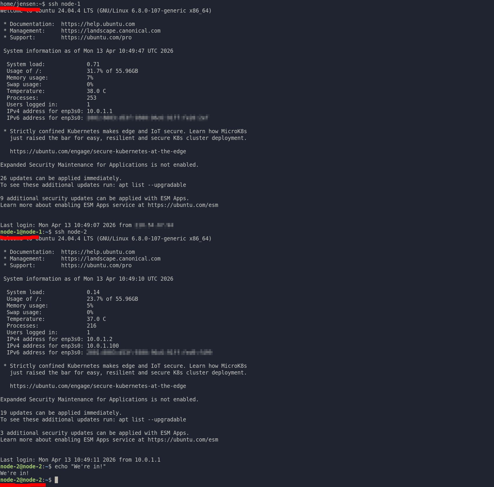

## Intro
In my last article, I built out the hardware for my 3-node cluster using salvaged e-waste PCs.

Now we need to get these machines to a software and OS configuration that is consistent, predictable, and ready to act as a single system.
I'll be treating each node as more or less disposable - if one breaks, I should be able to rebuild it quickly and get back to a known-good state.

---

## Key Decisions

***Ubuntu Server*** will be our operating system of choice here, for a variety of reasons. It's lightweight, so won't be an excess overhead on this ageing hardware, is well supported by k3s (the flavour of Kubernetes we'll be using later) and other software, and above all else I'm already very familiar with it!

I've installed it onto a 64GB USB flash drive on each node, with the remaining 4x500GB drives untouched for now. This process is pretty straightforward and there are plenty of guides elsewhere on how to do this. The OS runs from USB, but since workloads and storage are on separate drives, performance impact here is minimal.

Our storage backend will be running on ***MinIO***, which I'll cover in another article, but this one of the main reasons I wanted to build this cluster, as it's a really cool piece of software that means we can create an S3-compatible object store, distributed across all of our nodes. This pools all storage together, and anything that can use S3 can also talk to MinIO - meaning it has great compatibility out of the box.  
We'll use MinIO wherever possible, but it's only object storage, not block storage.
This means we’ll need to build some workarounds where traditional filesystems are required.

***K3s*** will be our Kubernetes software of choice. It's much simpler than full Kubernetes (K8s), so will run better on our small cluster, while also offering almost all of the same features to learn with.

<br>

---
<br>

### Standardise Everything!

Every node needed to be identical. It needs an identical storage layout for MinIO, which we will setup later. It also needs an identical setup so that Kubernetes can run without issues, and pods can be scheduled on any of the three nodes, without issue.
This is one of those things that feels unnecessary at the time, but saves hours of debugging later - everything I'm doing here on node-1 gets reflected onto 2 & 3.

So, we've already got the OS the same, but we still need:
- Same packages
- Same network setup (we'll organise most of this in the next article!)
- Same disk layout  
    <br/>

We also need to keep security of our servers in mind too, so we'll do some hardening of the systems as well.

Before we get started on any of that though, let's make sure we're up to date with the following command.

```bash
sudo apt update && sudo apt upgrade -y
```

<br>

---
<br>

### 1\. Install Base Packages

Before doing anything else, I'll install the tools and other software that we'll need - both now and later.

On Ubuntu, we use the inbuilt package manager, 'apt', to sort this out for us.

```bash
sudo apt install git fail2ban s3fs curl speedtest-cli iperf3 docker-compose-v2 docker.io mdadm parted 
```

<br>

---
<br>

### 2\. Network Hardware Validation

Before building on top of anything, I needed to confirm the hardware is all being detected and working as expected.  
We'll start with the networking hardware/config using these commands to check it all out.

A quick note regarding networking that we'll explore more later, but my network is on a Class A private address range of 10.0.0.0/16.  
10.0.0.x is for the home network  
10.0.1.x is for the cluster, and has been assigned addresses .1-3

**Check all interfaces are detected (our 1x1Gb LAN + 2x10Gb SFP+ links)**

```bash
node-1@node-1:~$ lspci | grep -i ethernet
01:00.0 Ethernet controller: Intel Corporation 82599ES 10-Gigabit SFI/SFP+ Network Connection (rev 01)
01:00.1 Ethernet controller: Intel Corporation 82599ES 10-Gigabit SFI/SFP+ Network Connection (rev 01)
03:00.0 Ethernet controller: Realtek Semiconductor Co., Ltd. RTL8111/8168/8211/8411 PCI Express Gigabit Ethernet Controller (rev 0c)
node-1@node-1:~$ 
```

**Each node is getting its correct IP address from DHCP on my router**  
This is just the enp3s0 gigabit ethernet that we're worried about for our LAN. The other two interfaces we'll look at later.

```bash
node-1@node-1:~$ ip a
2: enp3s0: <BROADCAST,MULTICAST,UP,LOWER_UP> mtu 1500 qdisc fq_codel state UP group default qlen 1000
    inet 10.0.1.1/16 metric 100 brd 10.0.255.255 scope global dynamic enp3s0
```

**Each node is getting internet access at full speed**  
Yep, unfortunately only 500/50, but that’s the reality of internet in Australia.

```bash
node-1@node-1:~$ speedtest
Retrieving speedtest.net configuration...
Testing from Telstra Internet...
Retrieving speedtest.net server list...
Selecting best server based on ping...
Testing download speed...
Download: 506.04 Mbit/s
Testing upload speed...
Upload: 47.87 Mbit/s
```

I've only shown these commands running on node-1, but node-2 and node-3 are good to go too.  
We'll also need to go through and setup our 10G links properly, but I'm saving that for the next article!

Before we finish up here, we'll also set a hostname on the LAN interface for each of the nodes, e.g. `sudo hostnamectl set-hostname node-1`

<br>

---
<br>

### 3\. Disk Validation and Layout

This is one of the easiest places to introduce subtle issues, as MinIO is VERY picky about the drive volumes that you pass to it.

All nodes need identical partition layouts, with matching partition sizes.  
As a reminder, each node has 4x500GB drives, however due to being from different brands, each differs slightly in it's actual capacity.

So, we'll have to figure out which drive is the smallest, and partition the others accordingly. We can find this by running the following on each:

```bash
node-1@node-1:~$ sudo fdisk -l /dev/sdb
Disk /dev/sdb: 465.76 GiB, 500107862016 bytes, 976773168 sectors
Disk model: Samsung SSD 850
```

This is the smallest of our 12 drives at 465.8GB, so we need to create partitions on our other 11 drives that are all the same size. I used the 'parted' tool to do this.
I actually had to redo part of this after realising how strict MinIO is about disk layout though - it must be accurate down to the byte, close enough is not good enough.

We're left with some spare room on a few of the drives, so I used 'mdadm' to create a RAID1 array with this leftover space, which will come in handy later.  
I had to backtrack and do this step, as I setup some stuff to use the OS drive, which is just a USB stick so can't really handle lots of reads and writes - the ~11GB RAID1 performs much better, and is small but big enough for this.  
It also provides us with a layer of redundancy in the case of a drive failure.

```bash
sudo mdadm --create /dev/md0   --level=1   --raid-devices=2   /dev/sda2 /dev/nvme0n1p2
```

&nbsp;

We'll also need to edit `/etc/fstab` and add an entry for each of our 4 drives + RAID (I'll get to this in a minute) in order for them to be automatically mounted at boot.
`UUID=xxxxxxxx /mnt/minio1 xfs defaults,noatime 0 2`


After this, we are left with the following (identical on each node):

```bash
node-1@node-1:~$ lsblk
NAME        MAJ:MIN RM   SIZE RO TYPE  MOUNTPOINTS
sda           8:0    0 476.9G  0 disk  
├─sda1        8:1    0 465.8G  0 part  /mnt/minio1
└─sda2        8:2    0  11.2G  0 part  
  └─md0       9:0    0  11.2G  0 raid1 /mnt/raid
sdb           8:16   0 465.8G  0 disk  
└─sdb1        8:17   0 465.8G  0 part  /mnt/minio4
sdc           8:32   0 465.8G  0 disk  
└─sdc1        8:33   0 465.8G  0 part  /mnt/minio2
sdd           8:48   1  57.7G  0 disk  
├─sdd1        8:49   1   500M  0 part  /boot/efi
└─sdd2        8:50   1  57.2G  0 part  /
nvme0n1     259:0    0 476.9G  0 disk  
├─nvme0n1p1 259:1    0 465.8G  0 part  /mnt/minio3
└─nvme0n1p2 259:2    0  11.2G  0 part  
  └─md0       9:0    0  11.2G  0 raid1 /mnt/raid
```


<br>

---
<br>

### 4\. Filesystems + RAID

The [MinIO Docs](https://docs.min.io/enterprise/aistor-object-store/reference/aistor-server/requirements/storage/) reccomend using the XFS filesystem on each of the volumes you give to it, for best performance and compatibility.

```bash
sudo mkfs.xfs /dev/sdX1
```

As for our md0 (RAID1) volumes, I've just used EXT4 as this is what I've always used with Ubuntu, there's no particular reason why it's not a good choice.

```bash
sudo mkfs.ext4 /dev/md0
```

<br>

---
<br>

### 5\. Remote Access Model

Now, so far I've been SSH'd into each of these nodes using their username and password, over the local network. However, I will often need to access them remotely, but I didn’t want three publicly accessible machines - that's just unnecessary security risk, and will get confusing with multiple different port forwards.

I setup a single port forward on my router, with a randomly chosen port number (you can use the default port 22, but changing to a port in range >1024 will mean you get a bit less bot traffic trying to infiltrate the network) to 10.0.1.1 (node-1's LAN IP address).  
This gets me access, but it's not very secure.

Instead, we'll set up the following:

- Node-1 acts as a bastion (this just means that we use it to get to our other nodes)
- Nodes 2 & 3 are LAN-only
- Permit only SSH key-based authentication (no passwords allowed!)

This is fairly simple to setup, but takes a bit of work so I won't be documenting the commands used here. Basically it's just generating a keypair for each of the nodes, telling them to use it for SSH.  
Then on my laptop, I setup an alias which lets me run `ssh node-1` and get in without needing to specify a key file, port number, or domain name.  
I setup the same on node-1 so that once into that, I can run `ssh node-2` without having to specify username, keyfile, and IP address.  
Once I confirmed all of this was working, we block logging into SSH with a password by editing the following lines in `/etc/ssh/sshd_config`

```bash
PubkeyAuthentication yes
PasswordAuthentication no
PermitRootLogin no
```
(Here we also ensure that we don't allow root login, meaning a potential attacker would also need to elevate their permissions using the password before being able to do any damage)

So now, logging into node-2 looks like this.  



Finally, There's one more thing we can do here to protect the servers (well, node-1 specifically as that's what's exposed to the internet) - Fail2ban.
This is a piece of software that we installed earlier, which will block any login attempts that fail multiple times. It will automatically prompt you to set it up when installed, I'm using the default settings here.


Now we have a much more secure method of managing external access.
1.  Only 1 node exposed to the internet, rather than all three
    
2.  We only allow authentication using our keypair, rather than passwords which can theoretically be brute forced
    
3.  Fail2ban will block any malicious actors trying gain access with 3 or more failed attempts
    
This setup gives me a single controlled and protected entry point, while keeping the rest of the cluster isolated.

* * *
<br>

### 6\. Light Automation

A few small automations early on help avoid annoying issues later.

We'll setup 2 Cron jobs to automate these tasks for us. Cron is a package that is inbuilt into Ubuntu which performs simple actions based on a schedule - it's simple, but versatile and does everything we need here.  
Open the Crontab config file for editing with `crontab -e`

We'll add the following two lines to the bottom of the file.

1.  `/sbin/shutdown -r now` repeating weekly on Monday at 3am - guaranteed I won't be using the servers at this time!  
    We'll actually schedule it for 03:00, 03:10, 03:20, on each server respectively to spread it out and make sure that nothing actually goes down.  
    Rebooting weekly isn't really necessary, especially on Linux, but sometimes a reboot will fix issues, so why not do it (if I was running production services on here I wouldn't be doing this, but there's no downside for me personally)  
    Since our servers default to using UTC as their timezone (and it's helpful to keep it this way for debugging etc), we'll need to adjust this as Melbourne is at UTC+10, giving us 17:00 UTC as our reboot time.
    
2.  `curl -s "https://dynamicdns.park-your-domain.com/update?host=@&domain={domain_name}&password={pw}" >/dev/null`  
    This command will update the DNS record for my domain (I'm using Namecheap) with my home IP address in order to keep it current in order to ensure that if my public IP address changes, I can continue to access the nodes, as well as any services that we deploy on them in the future. This runs every 5 minutes, nonstop.
    

&nbsp;

We can use this [handy calculator](https://croncalculator.com/) to help us generate the first part of each Cron entry, which specifies when and how often it will run.  
This gives us the following (for node-1)

```bash
00 17 * * 1 /sbin/shutdown -r now
*/5 * * * * curl -s "https://dynamicdns.park-your-domain.com/update?host=@&domain={domain_name}&password={pw}" >/dev/null`
```

I'll also go and apply this to node-2 and node-3 so that they will also reboot periodically, and can take over the role of updating our DDNS in the event that node-1 is offline.

* * *

## Key Lessons

1. Early decisions ripple forward.
   Initially when I was working on this, I mucked up the partition sizes of the drives. This caused major headaches when setting up MinIO and I couldn't figure out why. The partitions need to be EXACTLY perfect, not 490GB or thereabouts, but exact, down to the byte.
2. Make the most of what you've got!
I tried setting up some of the later stuff using the my USB boot drive, as mentioned earlier, and it didn't work - the performance just isn't up to scratch, especially with USB 2.0 speeds. This is how we ended up with our RAID1 arrays - making the most of the previously wasted space due to discrepancies in the drive sizes.
3. Security first.
Spending time thinking about security now, and building from there, will save lots of time and headache later if we tried to just get everything working now, and shoehorn security strategies in as an afterthought.

<br>

- - -
<br>

## What's next?

That brings us to the end of the initial OS, storage, and network setup for the cluster.  
BUT, there's still plenty of work to do, with setting up 10g network links, getting our MinIO distributed storage system online, and installing K3s.  
Then we'll finally be able to move onto the fun stuff, deploying some actual services with Kubernetes.  
Stay tuned for part three - networking and K3s setup (this was a real headache...)
