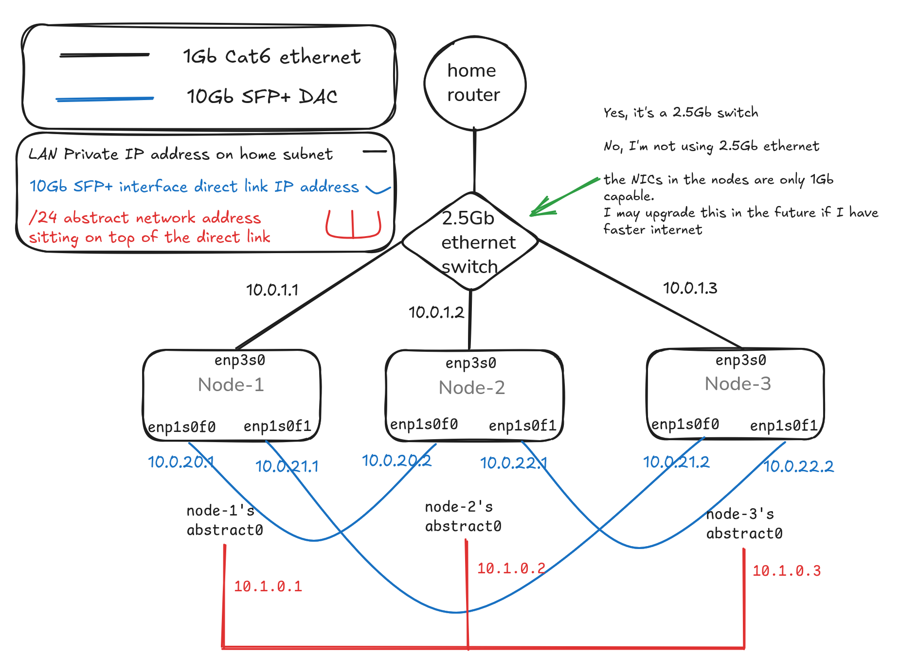
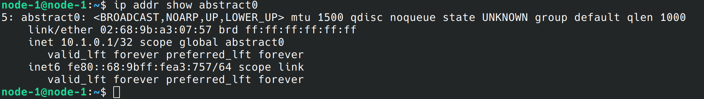
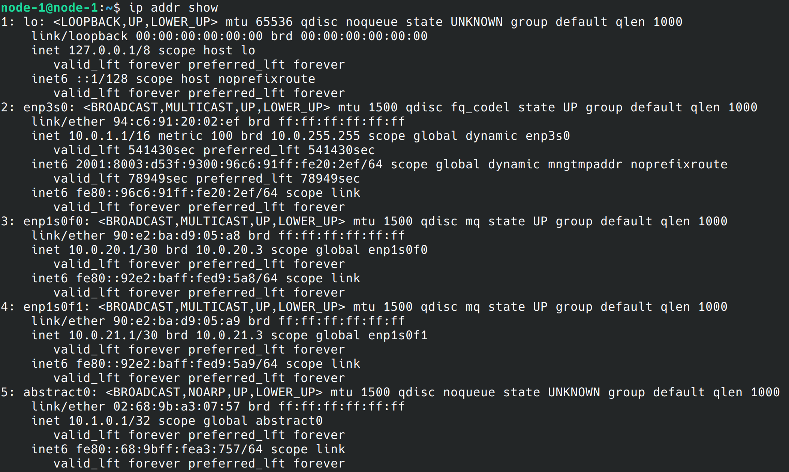
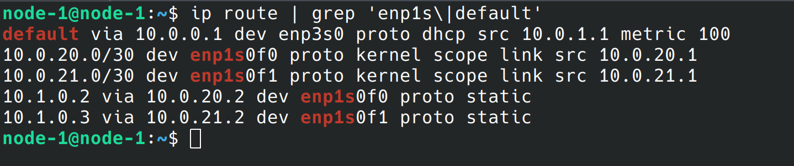
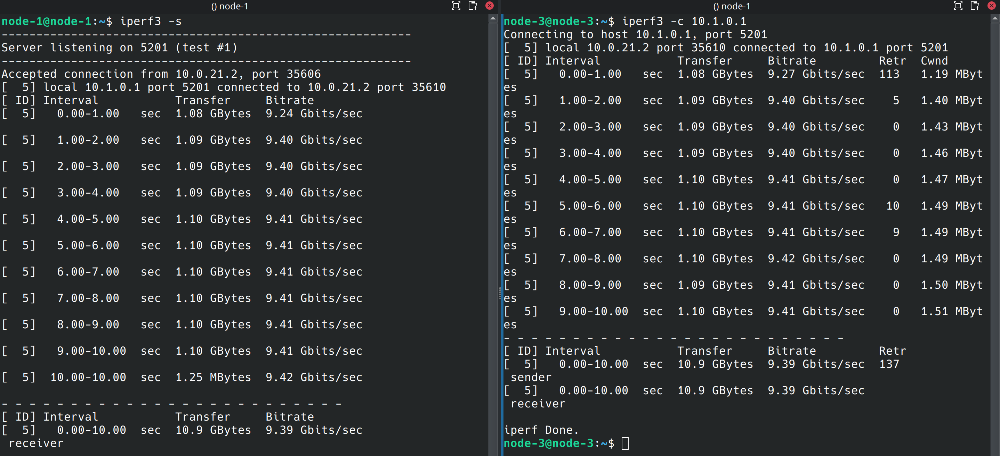

# **03 – Making 10Gb Work Without a Switch (and Finally Installing Kubernetes)**

> “The hardware was working.  
> The OS was clean.  
> Kubernetes should have taken 10 minutes to install.
> 
> It took days.”

But it wasn't Kubernetes fault, it was mine.
I'm a tightarse (read: Uni student trying to save for a house in one of the most unnaffordable places to live in the world), so didn't want to buy a 10Gig switch.
However, I like having nice things, so I decided to buy 10Gig NICs for my cluster anyway!


This turned out to be the most difficult part of the entire build - well, sorta. It didn't really need to be, I just had a specific idea in my head of how things needed to work, and needed to get better at building the solution around the constraints I already had.

But that being said, I love networking, probably a bit of a hot take, but subnetting and networking problems are my jam!

Let's dive right in.

* * *

## Intro

In the last article, I standardised the OS, storage layout, and access model across all three nodes.

At this point, everything *looked* ready for Kubernetes.

But there was one major problem left to solve:

**Networking.**

Not just basic connectivity - but getting a **3-node, 10Gb full-mesh network** to behave like a normal, predictable cluster network.

This turned out to be the most difficult part of the entire build - well, sorta. It didn't really need to be, I just had a specific idea in my head of how things needed to work, and needed to get better at building the solution around the constraints I already had.

But that being said, I love networking, probably a bit of a hot take, but subnetting and networking problems are my jam!
Let's dive right in.

* * *

## The Goal

Before touching Kubernetes, I needed:

- Reliable **node-to-node communication over 10Gb**
    
- A clean way for **distributed systems (especially MinIO)** to operate
    
- A **stable and predictable network** for Kubernetes
    

This led to an important design decision:

> Split the cluster into two separate networks:
> 
> - **Control Plane (1Gb LAN)** → Kubernetes, API, management, internet traffic
>     
> - **Data Plane (10Gb mesh)** → storage + high-throughput traffic
>     

* * *

## The Physical Topology

Each node has:

- 1× 1Gb interface → LAN (`10.0.1.x`)
    
- 2× 10Gb SFP+ interfaces → direct connections to the other nodes ```10.0.2x.0x```
    

This creates a **full mesh topology**, not a traditional switched network.

* * *

### 10Gb Link Addressing

Each physical connection is its own point-to-point subnet (/30):

**node-1**

- SFP0 → 10.0.20.1 (to node-2)
    
- SFP1 → 10.0.21.1 (to node-3)
    

**node-2**

- SFP0 → 10.0.20.2 (to node-1)
    
- SFP1 → 10.0.22.1 (to node-3)
    

**node-3**

- SFP0 → 10.0.21.2 (to node-1)
    
- SFP1 → 10.0.22.2 (to node-2)
    

* * *
Here's what we've got, with a sneak peak at the final config!


* * *

## The Problem

This setup is great for bandwidth, but terrible for simplicity.

* * *

### ❌ No Shared Network

There’s no switch, so:

- No single subnet
    
- No broadcast domain
    
- No automatic routing
    

Each link is isolated.

* * *

### ❌ Linux Uses the Wrong Interface

By default:

- Traffic prefers the **1Gb LAN**
    
- The 10Gb network is mostly ignored
    

Which defeats the entire purpose.

* * *

### ❌ Kubernetes Expects Simplicity

Kubernetes assumes:

- One IP per node
    
- Predictable routing
    
- A flat network
    

Instead, we had:

- Multiple interfaces
    
- Multiple possible paths
    
- No clear “correct” one
    

* * *

### ❌ Distributed Systems Break Easily

Tools like MinIO expect:

- Consistent connectivity
    
- Stable addressing
    

“Almost working” networking is not good enough.

* * *

## Failed Approaches

This is where most of the time went. Seriously, so painful, don't try it!
K3s just would not play ball on the 10Gig subnet. Not that there was anything wrong with it, just because it couldn't reliably communicate between nodes with the same address every time. Here's what I had tried so far. 

* * *

### Attempt 1 – Use 10Gb Interfaces Directly

- Assign IPs per link
    
- Try to use them directly in configs
    

**Result:**

- Works point-to-point
    
- Breaks cluster-wide communication
    
- Applications don’t understand topology
    

* * *

### Attempt 2 – Let Kubernetes Handle It

**Result:**

- Flannel picked the wrong interface
    
- Traffic went over 1Gb
    
- Intermittent issues


Attempt 3 - Don't use it at all (Wireguard)
- Tried setting up overwireguard (which is a built-in option in K3s. It's intended to allow you to connect nodes across multiple physical networks, over the internet.)
- It did actually work, but bandwidth limited to 5-6Gbps. <br>I paid for 10Gig, I wan't the full 10Gigs!
- In all seriousness, just to handle management/inter-pod traffic, this is heaps, except for the CPU overhead caused by handling those packets, which places far too much load on the nodes continually; I just couldn't have that either.
  

* * *

### Attempt 3 – Just Use the 1Gb LAN

- Everything runs over 1Gb
    
- Ignore 10Gb entirely
    

**Result:**

- Works fine
    
- Completely wastes the 10Gb investment
    

* * *

## The key realisation

Well, 2 realisations actually.

1. > I didn't actually need to use 10Gig for K3s at all! <br>The only thing that *really* matters, and the reason I decided on 10Gig NICs in the first place, was for fast **storage**. That's it.
   >
2. > I needed to stop trying to make applications understand the physical network.<br>Instead, **build a simpler network on top of it.**
   >

* * *

## The Solution

### 1\. Separate Control Plane and Data Plane

Instead of forcing everything onto one network:

- Kubernetes runs on **1Gb LAN (10.0.1.x)**
    
- Storage runs on **10Gb mesh (10.1.0.x subnet - you'll see in a sec!)**
    

This simplifies Kubernetes dramatically.

* * *

### 2\. Create an Abstract Network (10.1.0.0/24)
### Building the 10Gb “Virtual Network”
Each node gets a dummy interface: `abstract0`
We can see it's not actually connected to anything physical as the link state is "UNKNOWN"


Assigned IPs:

- node-1 → 10.1.0.1
    
- node-2 → 10.1.0.2
    
- node-3 → 10.1.0.3
    

This creates a **fake flat network**.

Importantly, this subnet is also *outside* of the range of the network in my home, which the nodes are already connected to on their 1Gb ports.

I initially just had this abstract layer on 10.0.100.x, and had problems, until I realised that the networks were conflicting! Simple fix though :)



* * *

### 3\. Static Routing

Traffic to this network is routed over the correct 10Gb links.

Example for Node-1:
To talk to Node-2, applications use
*10.1.0.2*
and get there via the address we can that specific physical link 
*10.0.20.2*

The same to get to Node-3:
- 10.1.0.3 → via 10.0.21.2


So:
> Applications just talk to 10.1.0.x  
> Linux handles how it gets there



* * *

### 4\. Result

We now have:

- A **single subnet (10.1.0.0/24)**
    
- Backed entirely by **10Gb links**
    
- With all complexity hidden away perfectly!
    

This is what MinIO will use later.

* * *

### Final Design

> Use the right network for the right job:
> 
> - Kubernetes → stable 1Gb
>     
> - Storage → fast 10Gb
>     

We can test this works with ```iperf3```


* * *

## Lessons Learned

### 1\. Physical ≠ Logical

Just because machines are connected, doesn’t mean they form a usable network!

* * *

### 2\. Abstraction Solves Complexity

The `abstract0` interface:

- Hid the messy topology
    
- Made everything else work cleanly
    

* * *

### 3\. Don't lock yourself into unecessary constraints!

This could have been, well not entirely avoided, but the extra hours (days...) of troubleshooting and head to wall contact could have been significantly reduced.
I had this idea in my head that we needed to 10Gig everything, when in reality, we didn't and this is actually a worse solution.

My made-up constraints wasted time, and would have lead to a worse solution than if I kept an open mind, which I ended up doing eventually - it just took me too long to get there!

By splitting up our traffic like this, we make more efficient use of our resources, have a more predictable amount of bandwidth for MinIO (our storage layer, if you forgot) to use later.
And then obviously, we actually got K3s working, as a result.
    
- - -
## What’s Next?

Now that networking is stable

We can finally move onto:
> Setting up Kubernetes, K3s.

Then,
> Distributed object storage with MinIO - where the 10Gb network really matters.

